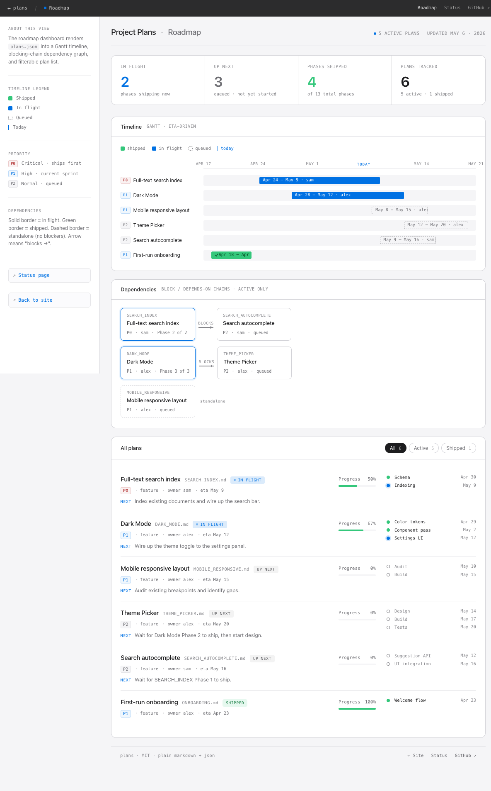
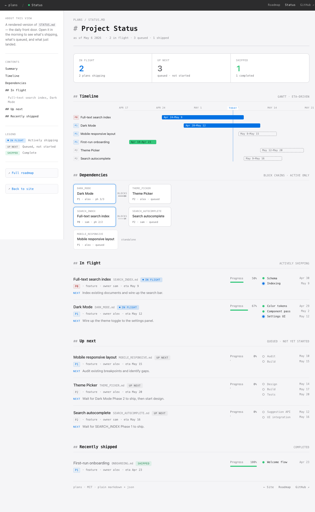

# Plans

[](https://github.com/yrangana/Plans/actions/workflows/pages/pages-build-deployment) [](https://github.com/yrangana/Plans/actions/workflows/test-init.yml)



> A lightweight intent layer for AI-assisted projects. Markdown + JSON, works with Claude Code, Antigravity, Cursor, or any AI coding assistant.

[Home](https://yrangana.github.io/Plans/) · [Roadmap demo](https://yrangana.github.io/Plans/roadmap.html) · [Status demo](https://yrangana.github.io/Plans/status.html) · [Slides](https://yrangana.github.io/Plans/presentation.html) · [Docs](https://yrangana.github.io/Plans/docs.html) · [Blog post](docs/blog-post.md) · [Reference spec](docs/reference.md)

---

## What this is

A spec-driven planning convention. Every project feature is a markdown file with structured frontmatter and a status banner. One `STATUS.md` answers "what's in flight, what's next, what just shipped". A static `roadmap.html` renders an interactive Gantt + dependency graph from the same data.

It works with any AI coding assistant. The data model is plain markdown and JSON. Only the instruction file (`CLAUDE.md`, `AGENTS.md`, `.cursorrules`) changes per platform.

## What you get

- A single source of truth for "what's in flight, what's next, what just shipped"
- Persistent context across plans, for yourself, over time
- Persistent context for your AI assistant across sessions
- A shareable visual roadmap for non-technical stakeholders
- Drift detection between intent (plans) and reality (git log)

**Interactive roadmap dashboard** ([live demo](https://yrangana.github.io/Plans/roadmap.html)):



**STATUS.md rendered** ([live demo](https://yrangana.github.io/Plans/status.html)):



## Is this for you?

| Adopt when | Skip when |
| --- | --- |
| Solo dev or small team (1 to 3 people) | Team of 5+ (use a real PM tool) |
| 3+ committed features in flight | Single-feature scope |
| AI-assisted development | Regulated environments (need audit trail) |
| Plans accumulating at repo root | Open source (use Issues) |

Full scope and audience details in [docs/reference.md](docs/reference.md).

---

## Quick Start

### 1. Install the plans CLI

One-liner (clones the repo to `~/.local/share/plans` and symlinks `plans-init` and `plans-update` to `~/.local/bin`):

```bash
curl -sSL https://raw.githubusercontent.com/yrangana/Plans/main/install.sh | bash
```

Re-run any time to update the plans system itself.

### 2. Bootstrap plans in your project

```bash
plans-init /path/to/your/project
```

Or copy the `template/plans/` directory manually if you prefer.

### 3. Tell your AI assistant about it

Append the contents of [`template/CLAUDE.md.snippet`](template/CLAUDE.md.snippet) to your project's `CLAUDE.md` (or `AGENTS.md`, `.cursorrules`, etc.).

### 4. Open the dashboard

Start any local file server from your project root, then open `http://localhost:8080/plans/roadmap.html`:

```bash
python -m http.server 8080   # Python 3
npx serve -l 8080            # Node.js
php -S localhost:8080        # PHP
```

### 5. Edit your first plan

Open `plans/active/EXAMPLE_PLAN.md`, replace it with your real first plan, and add a row to `plans/STATUS.md`.

---

## Updating

The plans CLI updates itself and your project's system files separately.

### Update the plans CLI

Either re-run the installer, or pull the repo manually:

```bash
curl -sSL https://raw.githubusercontent.com/yrangana/Plans/main/install.sh | bash
```

### Update an existing project's plans/

```bash
plans-update /path/to/your/project
```

This pulls the latest plans repo, shows a diff of system files, and asks before overwriting. User data (`STATUS.md`, `plans.json`, `active/`, `shipped/`) is never touched. Backups go to `<file>.bak`.

To skip the auto-pull (offline or when you have local edits in the plans repo): `plans-update --no-pull /path/to/your/project`.

### Uninstall the plans CLI

To remove the CLI commands without deleting the plans repo:

```bash
rm ~/.local/bin/plans-init ~/.local/bin/plans-update
```

The cloned repo at `~/.local/share/plans` is left in place. Delete it too if you want a clean slate:

```bash
rm -rf ~/.local/share/plans
```

Any `plans/` directories in your projects are unaffected (they are local-only and git-excluded).

See [CHANGELOG.md](CHANGELOG.md) for what's changed between versions.

---

## Docs and resources

Five ways into the system, depending on what you want:

| Resource | Best for | Format |
| --- | --- | --- |
| [**Home**](https://yrangana.github.io/Plans/) | Landing page with links to everything below | Web page |
| [**Roadmap demo**](https://yrangana.github.io/Plans/roadmap.html) | Seeing the Gantt dashboard with real data | Interactive web page |
| [**Status demo**](https://yrangana.github.io/Plans/status.html) | Seeing what STATUS.md looks like rendered | Interactive web page |
| [**Slides**](https://yrangana.github.io/Plans/presentation.html) | A 5-minute overview of the whole system | Reveal.js deck |
| [**Docs**](https://yrangana.github.io/Plans/docs.html) | Browsable docs rendered from the repo | Web page |
| [**Blog post**](docs/blog-post.md) | The story and motivation behind it | Long-form prose |
| [**Reference spec**](docs/reference.md) | Implementation details, every field, every rule | Technical reference |

---

## Repo Structure

```text
plans/
├── docs/                    # Full guide
│   ├── reference.md         # Technical spec
│   ├── blog-post.md         # Narrative explanation
│   └── presentation.html    # Slideshow
├── template/                # Drop-in starter for your project
│   ├── plans/               # The directory you copy into your repo
│   │   ├── README.md        # Onboarding doc
│   │   ├── STATUS.md        # Daily check-in template
│   │   ├── plans.json       # Machine-readable snapshot (empty to start)
│   │   ├── roadmap.html     # Interactive dashboard
│   │   ├── active/          # In-progress plans (with EXAMPLE_PLAN.md)
│   │   └── shipped/         # Completed plans
│   └── CLAUDE.md.snippet    # The section to add to your AI instruction file
├── scripts/
│   └── init.sh              # One-command setup
├── web/                     # GitHub Pages site (deployed automatically)
│   ├── index.html           # Landing page
│   ├── roadmap.html         # Live roadmap demo
│   ├── status.html          # Live STATUS.md demo
│   ├── presentation.html    # Slides
│   └── docs.html            # Browsable docs
└── examples/                # Static assets for README
    ├── demo.svg             # Animated demo
    ├── screenshot-dashboard.png
    └── screenshot-status.png
```

## How It Works

```text
plans/active/*.md             plans/shipped/*.md
   (frontmatter + banner)        (frontmatter + banner)
              \                  /
               \                /
                v              v
              plans/plans.json    <- machine-readable snapshot
              /              \
             v                v
   plans/STATUS.md       plans/roadmap.html
   (engineer's front     (stakeholder visual
    door)                 dashboard)
```

Git log is the ground truth for what shipped. Plan files are the intent layer. The `/plans sync` skill reconciles them weekly.

---

## The `/plans` Skill

A Claude Code slash command (and Antigravity skill, Cursor command) with two modes:

- **`/plans sync`**: weekly audit. Reads plan frontmatter, runs `git log`, detects drift, regenerates `plans.json` and STATUS.md auto-sections, shows proposed changes before writing.
- **`/plans new`**: guided creation of a new plan file with correct frontmatter and status banner.

Installed automatically by `plans-init`. See [docs/reference.md](docs/reference.md) for the full skill spec.

---

## Platform Compatibility

| Platform | Instruction file | Skill format |
| --- | --- | --- |
| Claude Code | `CLAUDE.md` | `.claude/skills/*.md` |
| Antigravity | `AGENTS.md` | `.agents/skills/*/SKILL.md` |
| Cursor | `.cursorrules` | Custom slash commands |
| Windsurf | `.windsurfrules` | Workflows |

The `plans/` directory is identical across all platforms.

---

## Contributing

This is a small, opinionated convention. Issues and PRs welcome for:

- Bug fixes in `template/plans/roadmap.html`
- Doc clarifications
- Cross-platform skill ports (Cursor, Windsurf)

For substantive changes to the convention itself (frontmatter spec, lifecycle), open an issue first to discuss.

## License

[MIT](LICENSE). Fork, adapt, share.
