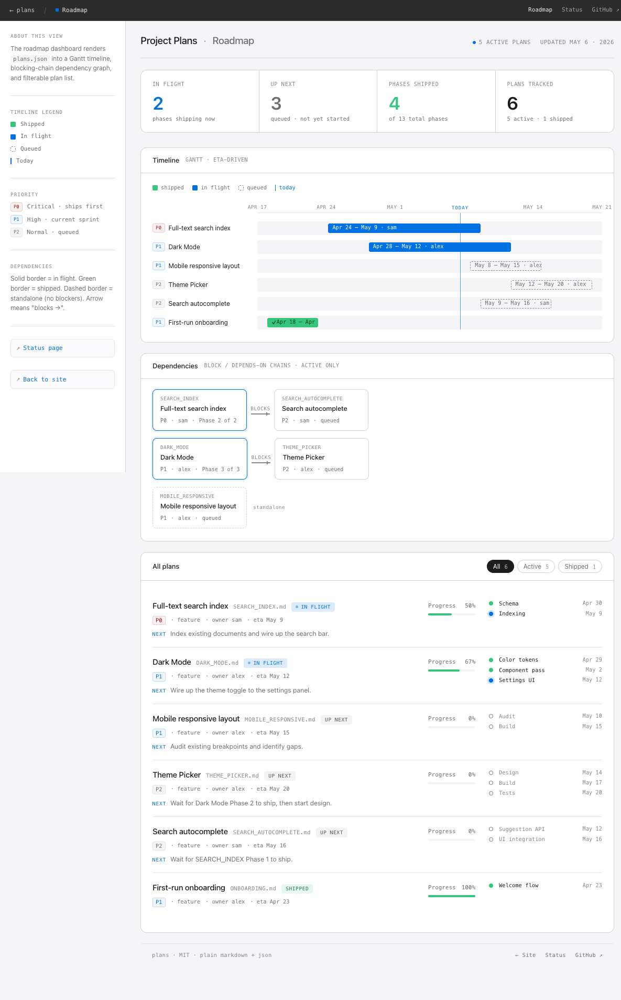
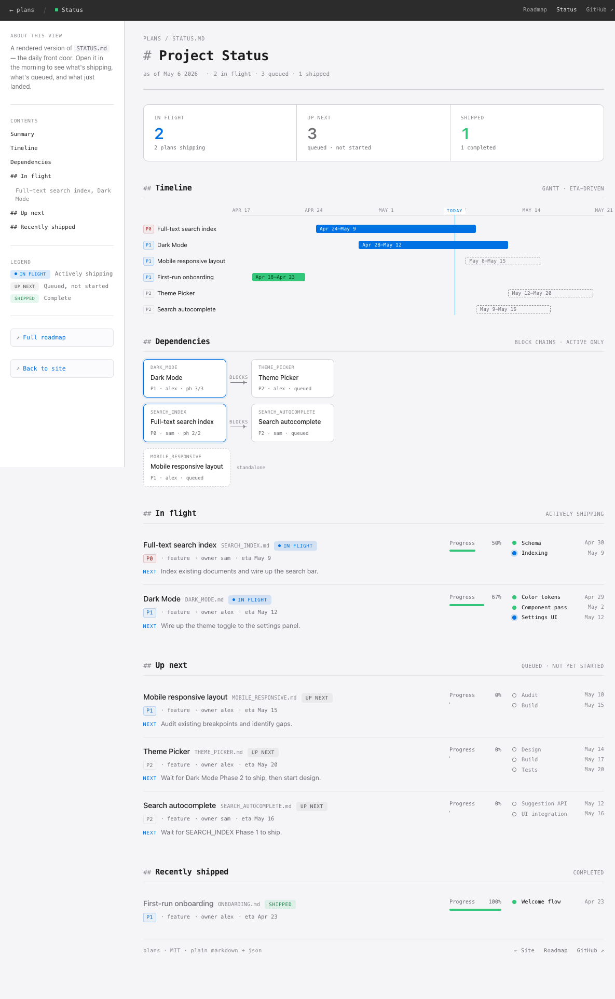

# Plans

[](https://github.com/yrangana/Plans/actions/workflows/pages/pages-build-deployment) [](https://github.com/yrangana/Plans/actions/workflows/test-init.yml)



> A markdown convention for tracking what you're building. Plain files in your repo, one source of truth for what's active, shipped, and next. AI assistants read it natively as a bonus.

[Home](https://yrangana.github.io/Plans/) · [Roadmap demo](https://yrangana.github.io/Plans/roadmap.html) · [Status demo](https://yrangana.github.io/Plans/status.html) · [Slides](https://yrangana.github.io/Plans/presentation.html) · [Docs](https://yrangana.github.io/Plans/docs.html) · [Blog post](docs/blog-post.md) · [Reference spec](docs/reference.md)

---

## What this is

A planning convention for solo devs and small teams. Every feature is a markdown file with structured frontmatter and a status banner. One `STATUS.md` answers "what's in flight, what's next, what just shipped". A static `roadmap.html` renders an interactive Gantt and dependency graph from the same data.

The primary audience is **you**, the person doing the work. The structure exists so you stop losing track of what you've shipped vs. what's still in flight. The fact that AI coding assistants (Claude Code, Cursor, Antigravity, Windsurf) can read your roadmap natively, because it's plain markdown with predictable shape, is a side effect, and a useful one.

The data model is plain markdown and JSON. On the script path, the instruction file (`CLAUDE.md`, `AGENTS.md`, `.cursorrules`) is how you tell your assistant the system exists, and it's the one thing that changes per platform. On the plugin path, no instruction-file change is needed at all, since the installed plugin is itself the assistant integration.

I built this for myself and use it daily across my own projects. It's MIT, small and readable end to end, and ships with everything you need including a Claude Code plugin, a CLI, a dashboard, and a `/plans sync` skill that audits your plans against your git log weekly.

**Where this sits in the wider trend:** AI-assisted development is shifting toward spec-driven workflows, where the spec is a first-class artifact your assistant reads and writes against. Tools like GitHub's Spec Kit handle the per-feature spec workflow. Plans is the portfolio layer that sits alongside: the multi-feature view of what's active, what shipped, what got abandoned, and what blocks what. Different layer, same shift.

## What you get

- A single source of truth for "what's in flight, what's next, what just shipped"
- Persistent context across plans, for yourself, over time
- Persistent context for your AI assistant across sessions
- A shareable visual roadmap for non-technical stakeholders
- Drift detection between intent (plans) and reality (git log)

**Interactive roadmap dashboard** ([live demo](https://yrangana.github.io/Plans/roadmap.html)):



**STATUS.md rendered** ([live demo](https://yrangana.github.io/Plans/status.html)):



## Where it fits

Best fit:

- Solo developers and small teams (1 to 4 people) juggling multiple features in parallel
- Projects with 3+ ideas in flight where context-switching costs are real
- AI-assisted workflows where you want your assistant to know what you've already shipped
- Repos accumulating loose `*_PLAN.md` files at the root with no shared shape

Less useful when: you already have a working Jira/Linear/Notion setup that fits your team, you're on a single-feature project, or you need a full audit trail for compliance.

Full scope and audience details in [docs/reference.md](docs/reference.md).

---

## Quick Start

### Claude Code (plugin, recommended)

```text
/plugin marketplace add yrangana/Plans
/plugin install plans@yrangana-plans
/plans:plans init
```

Three steps: add the marketplace, install the plugin, bootstrap your project. `init` creates `plans/`, asks whether to track it in git (default: keep it local), and points you at `/plans:plans new` for your first plan. Updates come through `/plugin`; refresh project system files any time with `/plans:plans update`. The plugin also supplies the project's operational rules (where to write plans, when to update status) automatically via a session hook, no CLAUDE.md edit needed.

### Other assistants and no-plugin setups

Works with Cursor, Antigravity, Windsurf, and any of the roughly 70 assistants the community skills CLI supports.

1. Install the skill:

   ```bash
   npx skills add yrangana/Plans
   ```

2. In your assistant, bootstrap the project:

   ```text
   /plans init
   ```

   `init` creates `plans/`, asks whether to track it in git (default: keep it local), and offers to append the planning rules to your `CLAUDE.md`, `AGENTS.md`, or `.cursorrules` (explicit consent, never twice).

3. Update the skill later with `npx skills update`.

Prefer plain scripts, with no assistant session involved? The CLI path is still supported:

```bash
curl -sSL https://raw.githubusercontent.com/yrangana/Plans/main/install.sh | bash
plans-init /path/to/your/project
```

Read it before running it:

```bash
curl -sSLO https://raw.githubusercontent.com/yrangana/Plans/main/install.sh
less install.sh && bash install.sh
```

### Then, on either path

Open the dashboard (any static file server from your project root, then `/plans/roadmap.html`):

```bash
python -m http.server 8080   # Python 3
npx serve -l 8080            # Node.js
php -S localhost:8080        # PHP
```

Edit your first plan: open `plans/active/EXAMPLE_PLAN.md`, replace it with your real first plan, and add a row to `plans/STATUS.md`.

---

## Updating

How you update depends on how you installed. Plugin installs update through `/plugin` and `/plans:plans update`; the plans CLI updates itself and your project's system files separately.

### Update via the plugin

Updates come through `/plugin`. Refresh your project's system files (`roadmap.html`, `plans/README.md`) any time with:

```text
/plans:plans update
```

### Update an npx-installed skill

```bash
npx skills update
```

### Update the plans CLI

Either re-run the installer, or pull the repo manually:

```bash
curl -sSL https://raw.githubusercontent.com/yrangana/Plans/main/install.sh | bash
```

### Update an existing project's plans/

```bash
plans-update /path/to/your/project
```

This pulls the latest plans repo, shows a diff of system files, and asks before overwriting. User data (`STATUS.md`, `plans.json`, `active/`, `shipped/`) is never touched. Backups go to `<file>.bak`.

To skip the auto-pull (offline or when you have local edits in the plans repo): `plans-update --no-pull /path/to/your/project`.

### Uninstall the plans CLI

To remove the CLI commands without deleting the plans repo:

```bash
rm ~/.local/bin/plans-init ~/.local/bin/plans-update
```

The cloned repo at `~/.local/share/plans` is left in place. Delete it too if you want a clean slate:

```bash
rm -rf ~/.local/share/plans
```

Any `plans/` directories in your projects are unaffected (they are local-only and git-excluded).

See [CHANGELOG.md](CHANGELOG.md) for what's changed between versions.

---

## Docs and resources

Five ways into the system, depending on what you want:

| Resource | Best for | Format |
| --- | --- | --- |
| [**Home**](https://yrangana.github.io/Plans/) | Landing page with links to everything below | Web page |
| [**Roadmap demo**](https://yrangana.github.io/Plans/roadmap.html) | Seeing the Gantt dashboard with real data | Interactive web page |
| [**Status demo**](https://yrangana.github.io/Plans/status.html) | Seeing what STATUS.md looks like rendered | Interactive web page |
| [**Slides**](https://yrangana.github.io/Plans/presentation.html) | A 5-minute overview of the whole system | Reveal.js deck |
| [**Docs**](https://yrangana.github.io/Plans/docs.html) | Browsable docs rendered from the repo | Web page |
| [**Blog post**](docs/blog-post.md) | The story and motivation behind it | Long-form prose |
| [**Reference spec**](docs/reference.md) | Implementation details, every field, every rule | Technical reference |

---

## Repo Structure

```text
plans/
├── docs/                    # Full guide
│   ├── reference.md         # Technical spec
│   ├── blog-post.md         # Narrative explanation
│   └── presentation.html    # Slideshow
├── template/                # What users copy into their projects
│   └── skills/
│       └── plans/           # The /plans skill (self-sufficient package)
│           ├── SKILL.md
│           ├── references/  # Per-mode logic loaded on demand
│           └── template/    # Bundled project template
│               ├── CLAUDE.md.snippet   # under skills/plans/template
│               └── plans/   # STATUS.md, plans.json, roadmap.html, active/, shipped/, superseded/
├── scripts/
│   └── init.sh              # One-command setup
├── web/                     # GitHub Pages site (deployed automatically)
│   ├── index.html           # Landing page
│   ├── roadmap.html         # Live roadmap demo
│   ├── status.html          # Live STATUS.md demo
│   ├── presentation.html    # Slides
│   └── docs.html            # Browsable docs
└── examples/                # Static assets for README
    ├── demo.svg             # Animated demo
    ├── screenshot-dashboard.png
    └── screenshot-status.png
```

## How It Works

```text
plans/active/*.md             plans/shipped/*.md
   (frontmatter + banner)        (frontmatter + banner)
              \                  /
               \                /
                v              v
              plans/plans.json    <- machine-readable snapshot
              /              \
             v                v
   plans/STATUS.md       plans/roadmap.html
   (engineer's front     (stakeholder visual
    door)                 dashboard)
```

Git log is the ground truth for what shipped. Plan files are the intent layer. The `/plans sync` skill reconciles them weekly.

---

## The `/plans` Skill, drift detection between intent and reality

The thing that makes this convention actually hold up over time: plans describe what you intended to do, git log records what actually happened. The two drift apart constantly. `/plans sync` reconciles them.

It's a Claude Code slash command (with Antigravity and Cursor ports) with four modes:

- **`/plans init`**: bootstraps `plans/` in a project from the bundled template. Works on every install path.
- **`/plans sync`**: weekly audit. Reads every plan's frontmatter, runs `git log`, runs 13 drift rules (stale plans, missing ETAs, orphaned dependencies, frontmatter contradictions, project header gaps), and proposes fixes as a diff. You review and confirm in about 2 minutes. Regenerates `plans.json` and the auto-managed sections of `STATUS.md`.
- **`/plans new`**: guided creation of a new plan file with correct frontmatter, status banner, and timeline.
- **`/plans update`**: refreshes system files (`roadmap.html`, `plans/README.md`) from the installed skill version. Works on every install path.

All four modes run the same way whether the skill was installed via the plugin, `npx skills add yrangana/Plans`, or the `plans-init` script. The `plans-init` and `plans-update` scripts remain as a no-assistant fallback for the two setup jobs. See [docs/reference.md](docs/reference.md) for the full drift-rule list.

---

## Platform Compatibility

| Platform | Instruction file | Skill format |
| --- | --- | --- |
| Claude Code | `CLAUDE.md` | `.claude/skills/*.md` |
| Antigravity | `AGENTS.md` | `.agents/skills/*/SKILL.md` |
| Cursor | `.cursorrules` | Custom slash commands |
| Windsurf | `.windsurfrules` | Workflows |

The `plans/` directory is identical across all platforms.

---

## Contributing

This is a small, opinionated convention. Issues and PRs welcome.

Highest-leverage contributions: skill ports to other AI assistants (Cline, Windsurf, aider), `roadmap.html` improvements (Mermaid export, print stylesheet), bug fixes, doc clarifications.

See [CONTRIBUTING.md](CONTRIBUTING.md) for specific asks, what to expect, and where the maintainer will push back. For substantive changes to the convention itself (frontmatter spec, lifecycle), open an issue first to discuss.

## License

[MIT](LICENSE). Fork, adapt, share.
