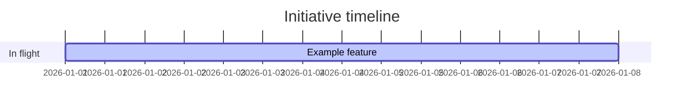
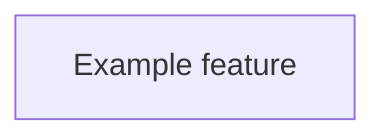

# {Your Project} — Project Status
*Last updated: YYYY-MM-DD*

> {One-paragraph project description. What is this thing? Who's it for?}

---

<!-- AUTO-GENERATED from plans/plans.json — edit plans/*.md frontmatter, not this section -->

## Roadmap at a glance

## In flight — what we're working on now

| Initiative | Status | Progress | Owner | ETA | Plan |
| --- | --- | --- | --- | --- | --- |
| Example feature | 🟡 In progress | Phase 1 of 2 | you | YYYY-MM-DD | [EXAMPLE_PLAN.md](active/EXAMPLE_PLAN.md) |

## Up next — committed for next 30 days

| Initiative | Why it matters | Effort | Depends on | Plan |
| --- | --- | --- | --- | --- |

## Cross-plan dependencies

<!-- END AUTO-GENERATED -->

---

## Recently shipped — last 30 days

| What | Shipped | Commit | Why it mattered |
| --- | --- | --- | --- |

## Monthly log — append-only history

### YYYY-MM

- {What landed this month}

---

## Backlog / ideas — captured, not committed

- **Idea 1** — short description, why it might matter
- **Idea 2** — short description, why it might matter

## Blocked / risks

| Item | Blocked on | Action needed | Since |
| --- | --- | --- | --- |
